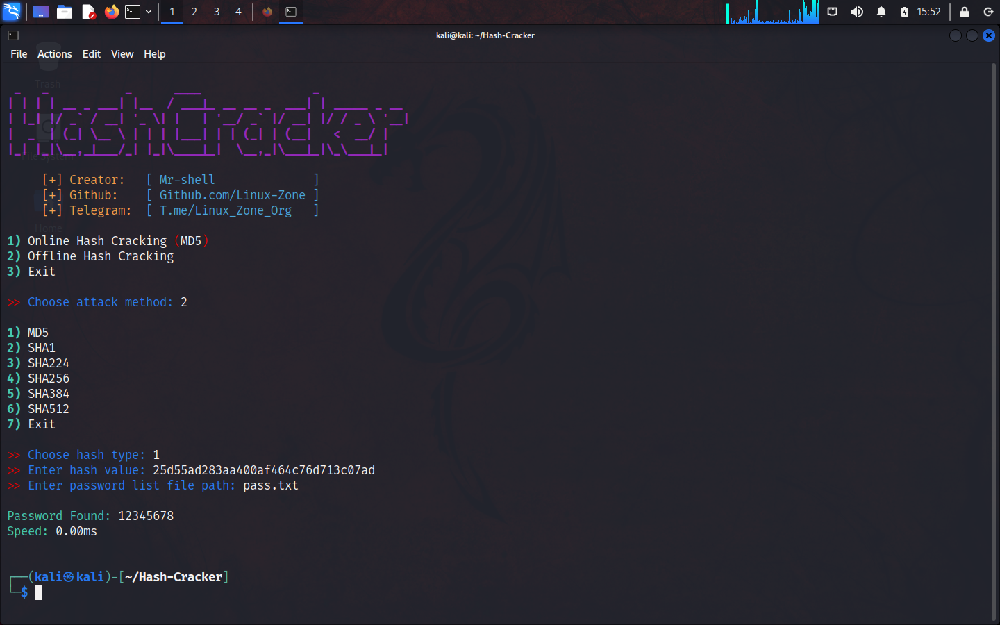

### Hash Cracker

python3 script to crack hashes

### Screenshot

    

### Installation

<pre>
<code>
git clone https://github.com/Linux-Zone/Hash-Cracker.git
cd Hash-Cracker
python3 main.py
</code>
</pre>

### 

Telegram Channel:  <a href="https://t.me/Linux_Zone_ORG">t.me/Linux_Zone_ORG</a>

More Tools:  <a href="https://github.com/Linux-Zone">github.com/Linux-Zone</a>

